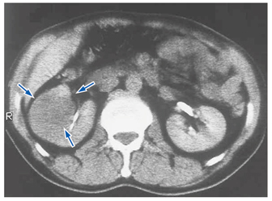

# 腎細胞癌

> **腎細胞癌**は、腎実質（主に近位尿細管上皮）から発生する成人の代表的な悪性腎腫瘍である。画像では、腎実質内の充実性腫瘤としてみられる。

腎実質内の腫瘤が腎の輪郭を変形させることが、腎細胞癌を示唆する。

## 要点

- 高齢男性に多く、健診や他疾患の検査で偶然発見されることも多い。
- 症状は無症候性肉眼的血尿、側腹部痛、腹部腫瘤が知られるが、初期には無症状のことが多い。
- 造影CTで腎実質内の造影される充実性腫瘤を評価する。腎静脈・下大静脈への腫瘍栓に注意する。

| 鑑別 | 発生部位・特徴 |
|---|---|
| 腎細胞癌 | 腎実質由来。腎実質内の充実性腫瘤として腎の輪郭を変形させる。 |
| [[腎盂・尿管癌]] | 腎盂の尿路上皮由来。腎盂内の充盈欠損や[[水腎症]]を示し、尿細胞診が参考になる。 |

- 小児の腎腫瘍では[[Wilms腫瘍]]を考える。

## CBTチェック

- **腎実質内の腫瘤** → 腎細胞癌、**腎盂内の病変** → [[腎盂・尿管癌]]と考える。
- 腎盂癌は腎細胞癌ではなく、尿路上皮癌（移行上皮癌）である。
