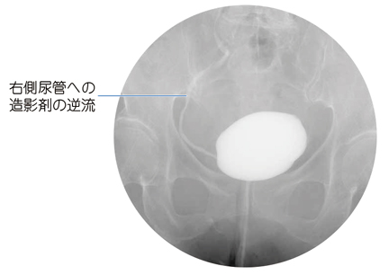

# 膀胱尿管逆流症

> **膀胱尿管逆流症**（vesicoureteral reflux：VUR）は、膀胱内の尿が尿管・腎盂へ逆流する病態である。小児の反復性有熱性尿路感染症の重要な原因で、腎瘢痕を生じうる。

排尿時膀胱尿道造影で、造影剤が膀胱から右尿管へ逆流している。

## 要点

- 原発性は尿管膀胱移行部の逆流防止機構の未熟・異常による。下部尿路閉塞や[[神経因性膀胱]]に伴う続発性もある。
- 小児の反復性有熱性尿路感染症、[[急性腎盂腎炎]]で疑う。女児に多い。
- 確定診断と重症度分類（I〜V度）には**排尿時膀胱尿道造影（VCUG）**を行う。
- 反復する腎盂腎炎は腎瘢痕を来し、[[逆流性腎症]]、高血圧、慢性腎臓病につながることがある。
- 低グレードは尿路感染予防と経過観察を基本とし、高グレードや感染再発例では内視鏡治療・尿管膀胱新吻合術を検討する。

## CBTチェック

- 小児の反復性腎盂腎炎では、**膀胱尿管逆流症**を考える。
- VURの診断はVCUGで、膀胱から尿管・腎盂への造影剤の逆流を確認する。
- VURは尿失禁の典型的な原因ではなく、尿路感染症・腎瘢痕の原因として重要である。
