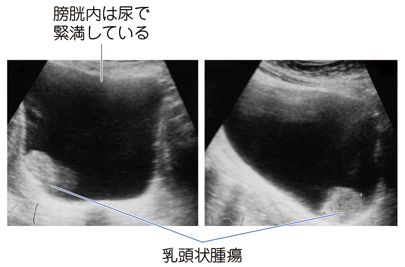

# 膀胱癌

> **膀胱癌**の多くは尿路上皮癌であり、**無症候性肉眼的血尿**が重要な症状である。尿検査で拾い上げ、膀胱鏡で病変を観察し、経尿道的膀胱腫瘍切除術（TURBT）の病理で確定する。

超音波で膀胱内に突出する乳頭状腫瘍を認める。確定には膀胱鏡・TURBTが必要である。

## 要点

- 喫煙、芳香族アミン曝露、[[腎盂・尿管癌]]の既往などがリスクとなる。
- 尿潜血検査・尿細胞診はスクリーニングや補助検査であり、陰性でも膀胱癌を完全には否定できない。
- **膀胱鏡検査**は病変を直接観察する最も重要な検査である。
- [急性膀胱炎](急性膀胱炎.md)、[尿管結石](尿管結石.md)、[神経因性膀胱](神経因性膀胱.md)、[[前立腺癌]]の診断に膀胱鏡を第一選択として用いることはない。
- 確定診断と深達度評価にはTURBTによる病理診断が必要である。
- CT・MRIは診断後の局所進展、リンパ節転移・遠隔転移の評価に用いる。

## 治療

- 筋層非浸潤性膀胱癌（全体の約70%）では、**TURBTが診断と治療を兼ねる**。再発リスクに応じて抗がん薬またはBCGの膀胱内注入を行う。
- 転移のない筋層浸潤性膀胱癌では、根治的膀胱全摘除術（骨盤リンパ節郭清・尿路変更を含む）が標準治療である。
- 膀胱温存を希望するなどの選択例では、TURBT・化学療法・放射線療法を組み合わせる集学的治療を行うことがある。
- 転移例や進行例では、薬物療法（化学療法など）を行う。

## CBTチェック

- **無症候性肉眼的血尿**では膀胱癌を疑う。
- 尿検査・腹部超音波は補助的で、膀胱癌の診断に重要なのは**膀胱鏡**、確定は**TURBTの病理**である。
- **筋層非浸潤性：TURBT／筋層浸潤性：膀胱全摘除術**を対比する。
