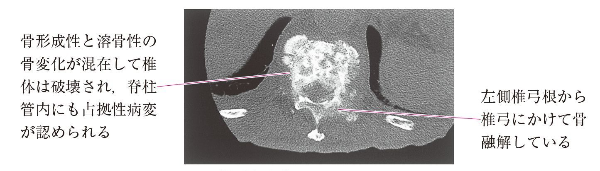

# 骨転移

> 原発腫瘍の細胞が骨へ移動して形成する転移性骨腫瘍。骨へ到達する主な経路は血行性転移であり、乳癌・前立腺癌などで重要である。

## 要点

- 原発巣 → 血管内へ浸入 → 血流に乗る → 骨の微小循環に捕捉・血管外へ移動 → 骨転移巣を形成する。
- 骨転移は疼痛、病的骨折、高カルシウム血症などの原因となる。
- 骨形成型は前立腺癌・乳癌で多く、溶骨型は腎癌・甲状腺癌・肺癌・多発性骨髄腫などでみられる。両者が混在する混合型もある。
- 椎体転移では椎体破壊や脊柱管内進展により脊髄・馬尾を圧迫し、背部痛に続く下肢脱力・感覚障害や対麻痺を来すことがある。急性麻痺は緊急性が高い。
- 腫瘍の進展形式は、直接浸潤・血行性転移・リンパ行性転移・播種に大別して考える。
- リンパ行性に広がった腫瘍細胞が最終的に血流へ入ることはあるが、骨へ到達する段階の経路は血行性と考える。
- 直接浸潤は原発巣と連続する隣接組織への進展、播種は腹腔・胸腔など体腔内への散布であり、骨転移とは区別する。

## CBTチェック

- 「骨転移の成立経路」→ 血行性転移。
- 「腫瘍細胞が血中を流れ、骨の微小循環に捕捉」→ 骨転移を考える。
- 「高齢男性」「骨形成型の脊椎転移」＋「PSA測定」→ 前立腺癌を考える。
- 「椎体病変＋下肢麻痺」→ 脊髄圧迫を疑い、緊急に画像評価する。
- 「左鎖骨上窩リンパ節腫大」→ [[Virchow転移]]（リンパ行性転移）を考えるが、骨転移の直接の経路とは区別する。

椎体転移による混合性骨病変。椎体破壊と脊柱管内占拠性病変を認める（M3E問題画像、個人学習用）。

