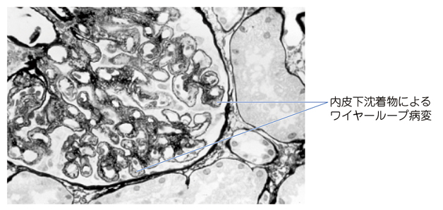

# ループス腎炎

> ループス腎炎は、[[全身性エリテマトーデス（SLE）]]で免疫複合体が糸球体に沈着して生じる腎障害である。蛋白尿・血尿・[[尿沈渣と円柱|赤血球円柱]]を認め、腎機能低下へ進行することがある。

## 要点

- 若年女性で、蝶形紅斑、関節炎、血球減少などのSLE所見に蛋白尿・血尿を伴う場合に疑う。
- 活動性の指標として、[[抗dsDNA抗体]]高値、補体（C3・C4）低下、尿蛋白増加が重要である。
- 尿沈渣では赤血球円柱などの細胞性円柱を認め、活動性の[[糸球体腎炎]]を示唆する。
- 腎生検で病型・活動性・慢性度を評価する。増殖性病変（III・IV型）では、内皮下の免疫複合体沈着による**ワイヤーループ病変**が重要である。
- 治療は病型と重症度に応じて、グルココルチコイドと免疫抑制薬を用いる。

内皮下沈着物によるワイヤーループ病変（M3E 18303604、個人学習用）。

## CBTチェック

- **SLE所見＋蛋白尿・血尿＋低補体＋抗dsDNA抗体高値**からループス腎炎を考える。
- 発症機序は免疫複合体沈着によるIII型アレルギーで、IgAだけの沈着や微小血栓形成ではない（M3E 18303604）。
- SLEに高度蛋白尿・低アルブミン血症を認めたら、病型と治療方針を決めるため腎生検を行う（M3E 18303603）。
