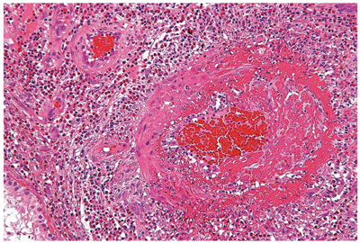

# 好酸球性多発血管炎性肉芽腫症（EGPA）

> **好酸球性多発血管炎性肉芽腫症（eosinophilic granulomatosis with polyangiitis：EGPA）**は、[[気管支喘息]]・好酸球増多を背景に起こる小〜中型[[血管炎]]。旧称はChurg–Strauss症候群、アレルギー性肉芽腫性血管炎。

## 要点

- 多くは気管支喘息、[アレルギー性鼻炎](../耳鼻咽喉科/アレルギー性鼻炎.md)・[副鼻腔炎](../耳鼻咽喉科/副鼻腔炎.md)、鼻茸に続いて、著明な末梢血好酸球増多を認める。
- 血管炎期には**多発性単神経炎**、[触知可能紫斑](../../02_症候・診察/下肢の紫斑.md)、発熱、関節痛、肺浸潤影、心病変などを来す。
- 検査では好酸球増多、IgE高値、CRP上昇を認める。**MPO-ANCA**は一部で陽性であり、陰性でも否定できない。
- 生検で、好酸球浸潤を伴う壊死性血管炎・肉芽腫性炎症を認めれば診断の強い根拠となる。病理所見が得られない場合も、臨床像を総合して診断する。
- 治療は[副腎皮質ステロイド](../../06_薬剤/免疫・内分泌/副腎皮質ステロイド.md)が基本で、臓器障害が強い場合は免疫抑制薬を併用する。再発例では抗IL-5抗体薬（メポリズマブ）を用いることがある。

皮膚生検の例。小血管周囲に好酸球を主体とする炎症細胞浸潤を認める。

## CBTチェック

- **喘息 → 好酸球増多 → 多発性単神経炎**の流れはEGPAを強く示唆する。
- EGPAは[ANCA関連血管炎](ANCA関連血管炎.md)の一つで、MPO-ANCAは陽性なら支持所見だが必須ではない。
- 病理では**好酸球浸潤を伴う壊死性血管炎**が重要。
