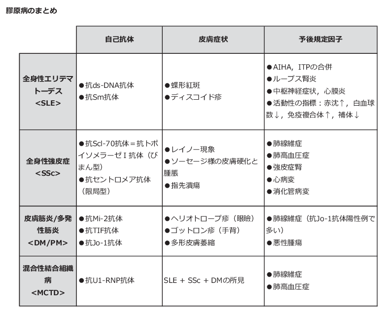

# 膠原病

## MOC

### 総論
- [[自己免疫]]
- [[自己抗体]]
- [ANCA関連血管炎](ANCA関連血管炎.md)
- [血管炎](血管炎.md)
- [[免疫複合体]]

---

## 全身性自己免疫疾患

- [全身性エリテマトーデス（SLE）](全身性エリテマトーデス（SLE）.md)
- [[シェーグレン症候群]]
- [全身性強皮症](全身性強皮症.md)
- [[多発性筋炎]]・[皮膚筋炎](皮膚筋炎.md)
- [[混合性結合組織病（MCTD）]]
- [[抗リン脂質抗体症候群]]
- [[ベーチェット病]]
- [[成人Still病]]

---

## 関節疾患

- [関節リウマチ](関節リウマチ.md)
- [関節リウマチの鑑別](関節リウマチの鑑別.md)
- [[変形性関節症]]
- [[強直性脊椎炎]]
- [[反応性関節炎]]
- [[乾癬性関節炎]]

---

## [血管炎](血管炎.md)

### 大型血管炎
- [高安動脈炎](高安動脈炎.md)
- [巨細胞性動脈炎](巨細胞性動脈炎.md)

### 中型血管炎
- [[結節性多発動脈炎]]（PAN）
- [川崎病](川崎病.md)

### 小型血管炎
- [[多発血管炎性肉芽腫症]]（GPA）
- [[顕微鏡的多発血管炎]]（MPA）
- [好酸球性多発血管炎性肉芽腫症（EGPA）](好酸球性多発血管炎性肉芽腫症（EGPA）.md)
- [[IgA血管炎]]

---

## 自己抗体

### 抗核抗体（ANA）
- [[抗dsDNA抗体]]
- [[抗Sm抗体]]
- [[抗SS-A抗体]]
- [[抗SS-B抗体]]
- [[抗Scl-70抗体]]
- [[抗セントロメア抗体]]
- [[抗Jo-1抗体]]
- [[抗U1-RNP抗体]]
- [[抗リン脂質抗体]]

### ANCA
- [[PR3-ANCA]]
- [[MPO-ANCA]]

### 関節リウマチ
- [[リウマトイド因子]]
- [[抗CCP抗体]]

---

## CBT頻出対応

| 疾患               | 覚える自己抗体                     |
| ---------------- | --------------------------- |
| SLE          | 抗dsDNA抗体・抗Sm抗体      |
| シェーグレン症候群    | 抗SS-A抗体・抗SS-B抗体     |
| 全身性強皮症       | 抗Scl-70抗体・抗セントロメア抗体 |
| 多発性筋炎・皮膚筋炎   | 抗Jo-1抗体                     |
| MCTD             | 抗U1-RNP抗体                   |
| 関節リウマチ       | 抗CCP抗体・リウマトイド因子     |
| GPA          | PR3-ANCA                |
| MPA・EGPA | MPO-ANCA                |
| 抗リン脂質抗体症候群   | 抗リン脂質抗体                 |

自己抗体・皮膚所見・主要臓器障害を比較する概略図：

| 疾患 | 鑑別の核 | CBTで重要な臓器障害 |
| --- | --- | --- |
| [[全身性エリテマトーデス（SLE）|SLE]] | 抗dsDNA・抗Sm抗体、蝶形紅斑 | [ループス腎炎](ループス腎炎.md)、中枢神経障害、血球減少 |
| [[全身性強皮症]] | 抗Scl-70抗体／抗セントロメア抗体、[Raynaud現象](../../02_症候・診察/Raynaud現象.md)・皮膚硬化 | 間質性肺疾患、肺[高血圧症](../循環器/高血圧症.md)、強皮症腎クリーゼ |
| [[皮膚筋炎]]・[[多発性筋炎]] | ヘリオトロープ疹・Gottron徴候、抗Jo-1抗体 | 間質性肺疾患、悪性腫瘍 |
| [[混合性結合組織病（MCTD）|MCTD]] | 抗U1-RNP抗体、SLE・強皮症・筋炎の所見が混在 | 肺高血圧症 |

