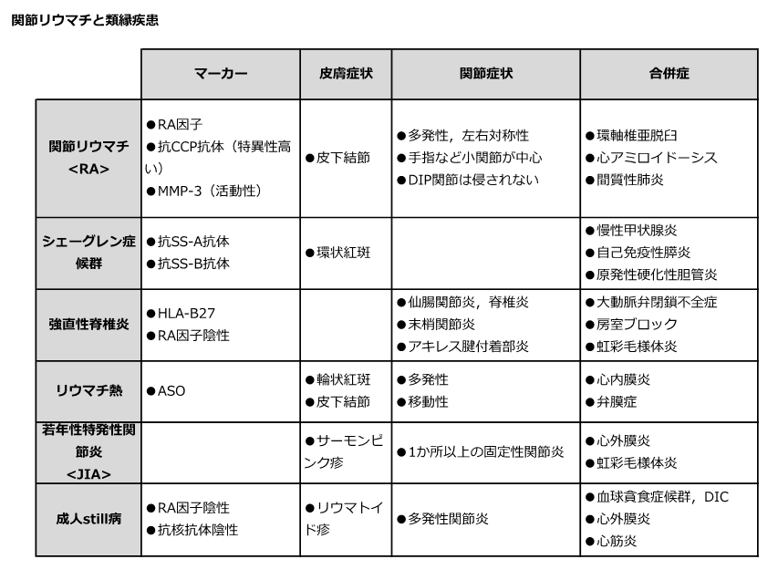

# 関節リウマチの鑑別

> [[関節リウマチ]]では、対称性の小関節炎・朝のこわばり・抗CCP抗体を軸に、関節分布、皮膚・眼症状、全身症状を組み合わせて鑑別する。

## 主な鑑別

- **[[脊椎関節炎]]**：仙腸関節炎、炎症性腰痛、付着部炎・ぶどう膜炎が手掛かり。RF・抗CCP抗体は通常陰性で、HLA-B27が参考になる。
- **[[リウマチ熱]]**：溶血性連鎖球菌感染後の**移動性多関節炎**。ASO上昇、心炎、輪状紅斑、皮下結節を確認する。
- **[[若年性特発性関節炎]]（JIA）**：16歳未満で発症する慢性関節炎。全身型では弛張熱とサーモンピンク疹、少関節型ではぶどう膜炎に注意する。
- **[[成人Still病]]**：弛張熱、サーモンピンク疹、多関節炎、著明なフェリチン上昇が典型的で、RF・抗核抗体は陰性が多い。
- **[[全身性エリテマトーデス（SLE）]]／[[シェーグレン症候群]]**：口内炎・蝶形紅斑・Raynaud現象や乾燥症状、対応する自己抗体から区別する。関節症状だけで結論づけない。

学習用比較図（各疾患の代表所見を俯瞰するための参考図）：

## CBTチェック

- RA：手指などの対称性小関節炎、DIP関節は通常保たれる、抗CCP抗体。
- 脊椎関節炎：体軸・仙腸関節、付着部炎、HLA-B27。RAの血清マーカーは通常陰性。
- **移動性**関節炎はリウマチ熱、**弛張熱＋サーモンピンク疹**は成人Still病を考える。
