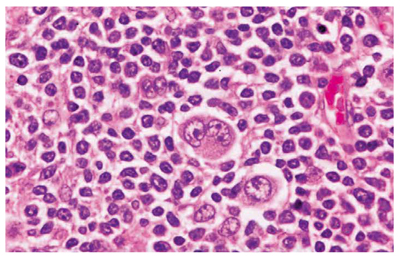

# Hodgkinリンパ腫

> Hodgkinリンパ腫（Hodgkin lymphoma：HL）は、[[Hodgkin細胞]]や[[Reed-Sternberg細胞]]を特徴とするB細胞由来の悪性リンパ腫である。

## 要点

- 若年成人と高齢者に好発する二峰性の年齢分布を示し、無痛性の頸部・鎖骨上窩リンパ節腫脹で発見されることが多い。
- 隣接するリンパ節へ連続性に進展し、節外病変は[[非Hodgkinリンパ腫]]より少ない。発熱、盗汗、6か月で10％を超える体重減少を[[B症状]]という。
- **Hodgkin細胞**は単核、[[Reed-Sternberg細胞]]は2核または多核の大型細胞である。2つの鏡像状の核と好酸性核小体は**owl's eye（フクロウの目）**と表現される。
- 古典的Hodgkinリンパ腫ではReed-Sternberg細胞はCD15・CD30陽性が典型である。RS様細胞は伝染性単核球症や反応性病変などにもみられうるため、組織構築と免疫染色を合わせて診断する。
- 病期に応じて化学療法（[[ABVD療法]]など）と放射線療法を組み合わせる。

大型のReed-Sternberg細胞では、好酸性の核小体と核小体周囲の明庭（halo）を認める。単核の細胞はHodgkin細胞である。

| [[Ann Arbor分類]] | 病変の広がり |
|---|---|
| I期 | 1つのリンパ節領域 |
| II期 | 横隔膜の同側に2つ以上のリンパ節領域 |
| III期 | 横隔膜の両側のリンパ節領域 |
| IV期 | 骨髄・肝臓などへの非連続性・びまん性節外病変 |

Aは[[B症状]]なし、Bは発熱・盗汗・6か月で10％を超える体重減少のいずれかを伴う。

## CBTチェック

- [[Reed-Sternberg細胞]]＋無痛性リンパ節腫脹からHodgkinリンパ腫を考える。
- **単核＝Hodgkin細胞、二核のowl's eye＝Reed-Sternberg細胞**。
- Hodgkinリンパ腫には、CBTで疾患特異的に暗記する代表的な染色体転座はない。
