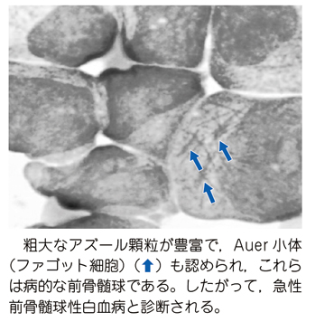

# 急性前骨髄球性白血病

> 急性前骨髄球性白血病（acute promyelocytic leukemia：APL）は、異常な前骨髄球が増殖する[[急性骨髄性白血病]]（AML）の一病型で、[[DIC]]を合併しやすい。

## 要点

- t(15;17)により[[PML::RARA融合遺伝子]]が形成され、骨髄系細胞の分化が前骨髄球段階で停止する。
- 異常前骨髄球には多数のアズール顆粒と、束状の[[Auer小体]]（ファゴット細胞）を認める。
- 線溶亢進型[[DIC]]による強い出血傾向をきたし、脳出血などの重篤な出血に注意する。
- [[全トランス型レチノイン酸]]（all-trans retinoic acid：ATRA）は、異常前骨髄球を成熟顆粒球へ分化誘導する。
- ATRAや[[三酸化ヒ素]]（ATO）による治療中は、発熱・呼吸困難・浮腫を示す[[APL分化症候群]]に注意する。

粗大なアズール顆粒と、束状の[[Auer小体]]（矢印）をもつ[[ファゴット細胞]]を認める。

## CBTチェック

- APL＝t(15;17)＝PML::RARA＝ATRAを一組で覚える。
- 束状のAuer小体＋DICからAPLを考える。
- ATRAは殺細胞薬ではなく[[分化誘導療法]]である。
