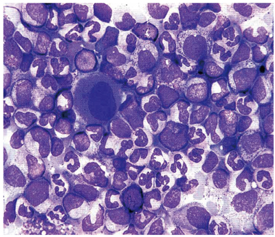

# 慢性骨髄性白血病

> 慢性骨髄性白血病（chronic myeloid leukemia：CML）は、[[BCR::ABL1融合遺伝子|Philadelphia染色体]]（Ph）上の[[BCR::ABL1融合遺伝子]]により、骨髄系細胞が腫瘍性に増殖する疾患である。

## 要点

- t(9;22) → BCR::ABL1融合遺伝子 → 恒常的なチロシンキナーゼ活性化 → 顆粒球系細胞が増加する。
- 末梢血では成熟段階の異なる顆粒球と[[好塩基球]]が増加し、脾腫を伴う。左上腹部圧迫感、早期飽満感、全身倦怠感を訴えることがある。[[好中球アルカリホスファターゼ]]（NAP）活性は低下する。
- 骨髄は過形成で、顆粒球系細胞がさまざまな成熟段階で増加する。染色体検査・FISH・RT-PCRでPhiladelphia染色体またはBCR::ABL1を確認して確定する。
- 慢性期の第一選択は[[BCR::ABL1チロシンキナーゼ阻害薬]]（TKI）で、代表薬は[[イマチニブ]]である。
- BCR::ABL1 mRNAを定量RT-PCRで追跡し、進行や[[急性転化]]を防ぐ。
- [[同種造血幹細胞移植]]は、主にTKI抵抗・不耐容例や進行期で検討する。

骨髄像では顆粒球系細胞の増加と、成熟段階が連続してみられることを確認する。

## CBTチェック

- CML＝t(9;22)＝[[BCR::ABL1融合遺伝子|Philadelphia染色体]]＝[[BCR::ABL1融合遺伝子]]＝[[チロシンキナーゼ阻害薬]]を一組で覚える。
- 白血球増加＋脾腫でCMLを疑い、確定には染色体検査などでBCR::ABL1を確認する。
- 慢性期CMLの第一選択はTKIであり、同種造血幹細胞移植を一律に第一選択とはしない。
- 白血球増加を示す[[類白血病反応]]ではNAP活性が上昇するため、NAP活性が低下するCMLと対比する。関連疾患との違いは[[骨髄系腫瘍の比較]]で確認する。
- 貧血に加えて、白血球・血小板増加、前骨髄球から分葉核好中球までの成熟顆粒球、好塩基球増加、脾腫を認めたらCMLを考える。[[自己免疫性溶血性貧血]]なら黄疸・網赤血球増加・直接[[Coombs試験]]陽性を確認する。
