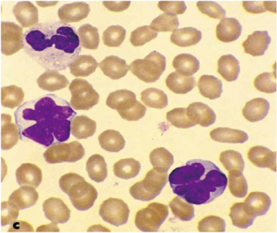

# 成人T細胞白血病・リンパ腫

> 成人T細胞白血病・リンパ腫（adult T-cell leukemia-lymphoma：ATL）は、[[HTLV-1]]感染CD4陽性T細胞が腫瘍化する成熟T細胞腫瘍である。

## 要点

- [[HTLV-1]]は主に母乳による[[母子感染]]、性行為、血液を介して感染し、長い潜伏期間を経て一部の感染者にATLを発症させる。
- 西南日本、特に九州・沖縄に多い。
- 末梢血では、核に深い切れ込みをもつ[[flower cell]]（花弁状細胞）が特徴である。
- リンパ節腫脹、肝脾腫、皮疹、[[高カルシウム血症]]、LD上昇、日和見感染を認める。
- 進行例では化学療法や抗CCR4抗体[[モガムリズマブ]]を用い、適応例では[[同種造血幹細胞移植]]を行う。

末梢血中に、核が花弁状に分葉したflower cellを認める。

## CBTチェック

- [[HTLV-1]]＋[[flower cell]]＋[[高カルシウム血症]]からATLを考える。
- HTLV-1の主要な母子感染経路は[[母乳感染]]である。
- ATLでは[[糞線虫症]]の過剰感染・播種に注意する。
