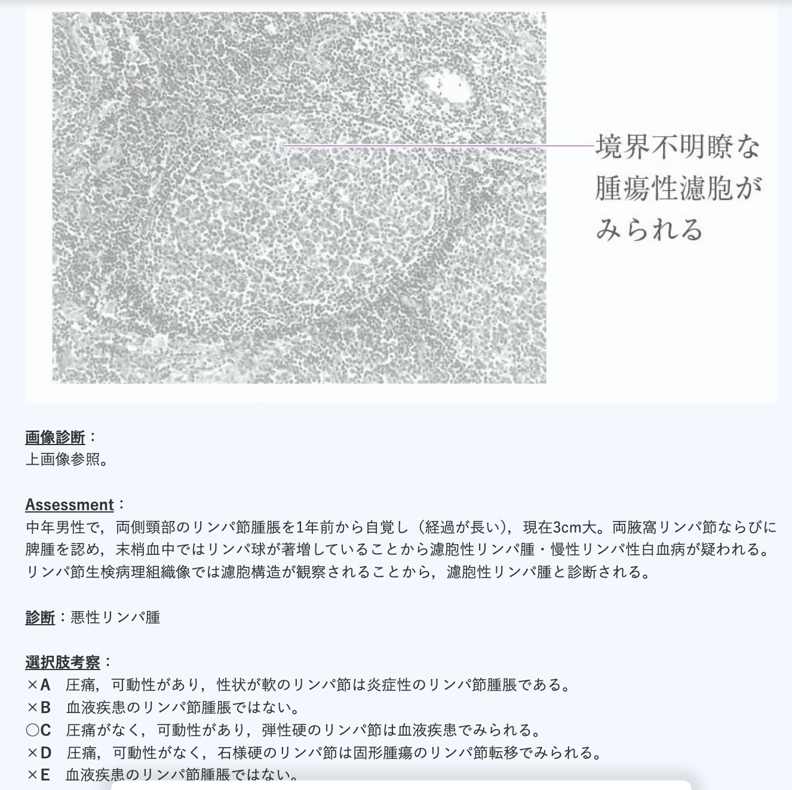

# 濾胞性リンパ腫

> 濾胞性リンパ腫（follicular lymphoma：FL）は、胚中心B細胞に由来する、緩徐に進行する低悪性度の[[非Hodgkinリンパ腫]]である。

## 要点

- 無痛性リンパ節腫脹で発見され、診断時には複数のリンパ節や骨髄へ広がっていることが多い。
- 病理では、均一で丸い[[濾胞性結節]]がリンパ節全体に密に増殖する濾胞性パターンを示す。
- t(14;18)による[[IGH::BCL2再構成]]が特徴で、BCL2過剰発現によりアポトーシスが抑制される。
- 無症候・低腫瘍量なら[[無治療経過観察]]、症候性・高腫瘍量なら[[リツキシマブ]]などの抗CD20抗体を含む治療を行う。
- 経過中に[[びまん性大細胞型B細胞リンパ腫]]へ組織学的形質転換することがある。

境界が不明瞭な腫瘍性濾胞が、リンパ節全体に密に増殖している。

## CBTチェック

- 「丸い濾胞性結節が密に増殖」＋「t(14;18)・BCL2」から濾胞性リンパ腫を考える。低悪性度で、無症候性なら経過観察も選択される。
- [[Hodgkinリンパ腫]]では[[Reed-Sternberg細胞]]、[[マントル細胞リンパ腫]]ではt(11;14)とcyclin D1が特徴である。
- 代表的な転座の比較は[[悪性リンパ腫の代表的染色体転座]]を参照する。
