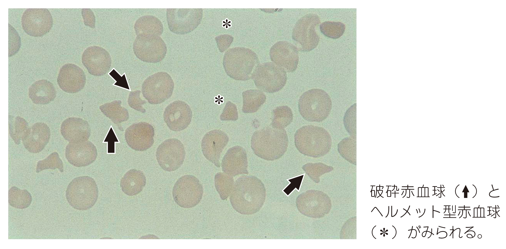

# 血栓性血小板減少性紫斑病

> 血栓性血小板減少性紫斑病（thrombotic thrombocytopenic purpura：TTP）は、[[ADAMTS13]]活性の著減により、血小板血栓が全身の細小血管に形成される疾患である。

## 要点

- 後天性TTPではADAMTS13に対する自己抗体が原因となることが多く、抗血小板薬[[チクロピジン]]などの薬剤でも誘発される。
- [[血小板減少]]と[[破砕赤血球]]を伴う微小血管障害性溶血性貧血が中心で、神経症状・発熱・腎障害を加えたものを古典的五徴候という。
- PT・APTTは通常正常であり、凝固検査が異常となる[[DIC]]と区別する。
- 疑ったら血漿交換を速やかに開始し、副腎皮質ステロイドや抗vWF薬[[カプラシズマブ]]を併用する。
- 血小板輸血は血栓形成を悪化させうるため、生命を脅かす出血時などを除き避ける。

末梢血塗抹標本で[[破砕赤血球]]（矢印）と[[ヘルメット型赤血球]]（＊）を認める。

## CBTチェック

- 血小板減少＋破砕赤血球＋凝固検査正常＋[[直接Coombs試験]]陰性からTTPを考える。
- TTP＝ADAMTS13活性著減＝治療は血漿交換。
- 腎障害ではBUN・クレアチニンが上昇する。血小板数が低くても安易に血小板輸血を行わない。
