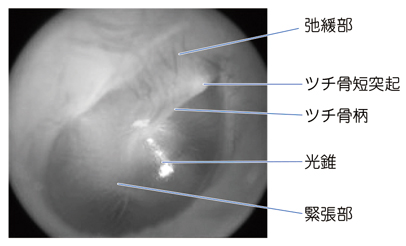

# 耳鏡検査

> 耳鏡検査では、外耳道と鼓膜の色調、膨隆・陥凹、穿孔、耳漏、およびツチ骨のランドマークを観察する。中耳炎や[[真珠腫性中耳炎]]の評価に用いる。

## 要点

正常鼓膜の主なランドマーク。ユーザー提供図、個人学習用。

- ツチ骨短突起より上方が[[弛緩部]]、大部分を占める下方が[[緊張部]]である。
- ツチ骨柄は鼓膜に付着し、前下方には三角形の光反射である[[光錐]]を認める。
- [[急性中耳炎]]では鼓膜発赤・膨隆、[[滲出性中耳炎]]では陥凹・液面、[[真珠腫性中耳炎]]では弛緩部の陥凹・角化物を確認する。

## CBTチェック

- ツチ骨短突起より上方 → [[弛緩部]]。
- 真珠腫性中耳炎で重要な部位 → 鼓膜弛緩部（上鼓室側）。
