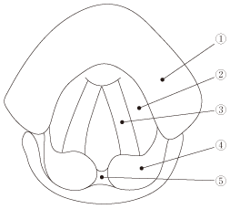

# 間接喉頭鏡

> 間接喉頭鏡は口腔から咽頭へ小鏡を挿入し、反射像として喉頭を観察する検査である。声帯の形態・左右差・運動を確認する。

## 要点

図は間接喉頭鏡で観察する主要部位。ユーザー提供図、個人学習用。

- 反射像のため上下は逆転し、像の上方は被験者の前方、下方は後方に相当する。左右は被験者と一致する。
- ①[[喉頭蓋]]、②[[仮声帯]]（前庭ヒダ）、③[[声帯]]（声帯ヒダ）、④楔状結節、⑤披裂間切痕。
- [[仮声帯]]は声帯の上外側をほぼ平行に走り、声帯は白色、仮声帯は赤色に見える。
- 声帯を外転・内転させて、声帯麻痺や[[喉頭癌]]などの病変を評価する。

## CBTチェック

- 「声帯の上外側を平行に走るヒダ」→[[仮声帯]]（前庭ヒダ）。
- 喉頭鏡像は上下が逆、左右は被験者と一致する。
