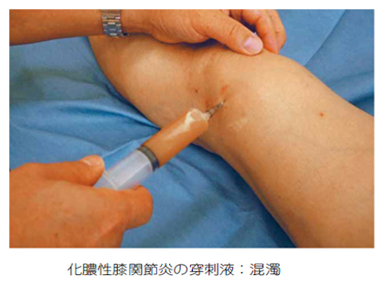
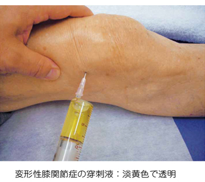
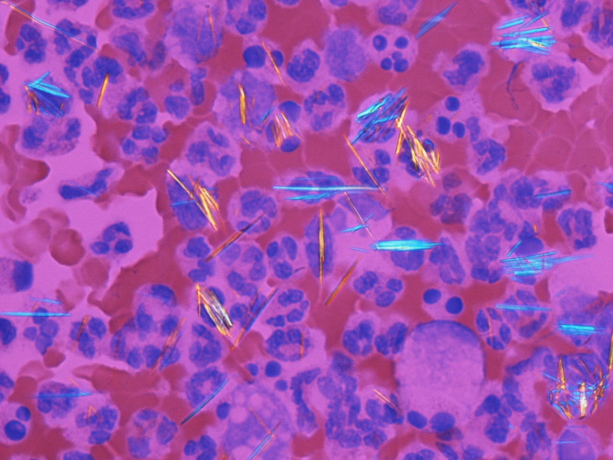

# 関節液検査

> 関節液は、外観・粘稠度・細胞数・糖・結晶・培養などから、正常、非炎症性、炎症性、化膿性に分類する。

## 要点

|状態|外観・粘稠度|代表疾患|
|---|---|---|
|正常|透明・高粘稠度|正常関節|
|非炎症性|透明〜半透明・粘稠度は比較的保たれる|変形性関節症、半月板損傷|
|炎症性|半透明〜混濁・粘稠度低下|[関節リウマチ](../../03_疾患/膠原病・免疫/関節リウマチ.md)、痛風|
|化膿性|混濁〜膿性・粘稠度低下|[[化膿性関節炎]]|

- 関節リウマチでは炎症によりヒアルロン酸が分解され、粘稠度は低下する。
- 関節リウマチは炎症性関節液（混濁、粘稠度低下）だが、痛風・偽痛風のような特徴的結晶はみない。
- 痛風は針状の尿酸一ナトリウム結晶、負の複屈折。偽痛風は菱形のピロリン酸カルシウム結晶、正の複屈折。
- 脂肪滴は骨折など関節内への骨髄脂肪流入を示唆し、半月板損傷の典型所見ではない。
- 化膿性関節炎では細胞数・好中球が増加し、培養を行って感染を確認する。

提示画像（個人学習用）：化膿性関節炎では関節液が混濁・膿性となる。

提示画像（個人学習用）：変形性関節症では関節液は淡黄色透明である。

痛風の関節液にみられる針状結晶。Gabriel Caponetti, Wikimedia Commons, CC BY-SA 3.0（[出典](https://commons.wikimedia.org/wiki/File:Gout_-_monosodium_urate_crystals_(20X,_polarized,_red_compensator).jpg)）。

## CBTチェック

- 正しい組合せ → **化膿性関節炎－膿性**。
- 正常関節液は透明、炎症性関節液は半透明〜混濁、化膿性関節液は膿性。
- 「針状・負の複屈折」→ 痛風。「菱形・正の複屈折」→ 偽痛風。
- 「血性関節液＋脂肪滴」→ 関節内骨折を疑う。
