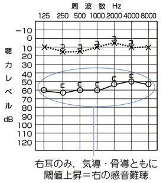

# 純音聴力検査

> **純音聴力検査**は、気導聴力と骨導聴力を比較して、[[伝音難聴]]と[[感音難聴]]を分ける検査である。

## 要点

| 型 | 気導 | 骨導 | 気骨導差 |
|---|---|---|---|
| 伝音難聴 | 上昇 | 正常〜軽度上昇 | あり |
| 感音難聴 | 上昇 | 上昇 | なし |

- 気導閾値・骨導閾値がともに上昇し、両者の差が小さい場合は感音難聴である。
- 片側感音難聴では、[[突発性難聴]]、[[Ménière病]]、[[聴神経腫瘍（前庭神経鞘腫）]]などを鑑別する。
- 聴力検査はめまいそのものを評価する検査ではないが、難聴を伴うめまいの病変部位・鑑別に役立つ。

右耳の気導・骨導閾値がともに上昇し、気骨導差がないため、右感音難聴を示す例。

## CBTチェック

- 気導・骨導ともに悪い、気骨導差なし → 感音難聴。
- 気導のみ悪い、気骨導差あり → 伝音難聴。
- 片側感音難聴では内耳道MRIで聴神経腫瘍を検索する。
