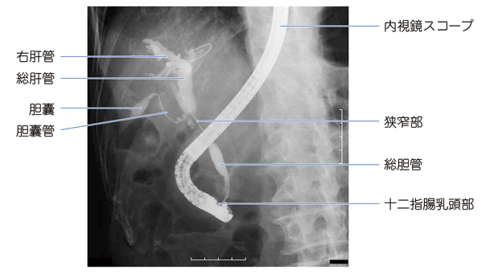

# 内視鏡的逆行性胆管膵管造影（ERCP）

> Endoscopic Retrograde Cholangiopancreatography（ERCP）。内視鏡で十二指腸乳頭へ到達し、胆管・膵管に造影剤を逆行性に注入して狭窄や閉塞を評価する検査。

## 要点

- 胆管狭窄の部位・範囲、胆管内への進展を評価し、胆汁細胞診や生検、ドレナージ・ステント留置にもつながる。
- 胆道の基本：右・左肝管が合流して総肝管となり、胆嚢管が合流した遠位側が総胆管で、十二指腸乳頭へ開口する。
- 黄疸を伴う狭窄では、閉塞部位より肝側の胆管が拡張する。総胆管狭窄では閉塞性黄疸をきたす。
- MRCPは非侵襲的に胆管・膵管を描出できる一方、ERCPは侵襲的であり、[急性膵炎](../../03_疾患/消化器/急性膵炎.md)などの合併症に注意する。
- ERCP後の腹痛・背部痛や膵酵素上昇では、ERCP後急性膵炎を疑う。

総胆管のV字型狭窄を示すERCP像。胆管の狭窄は[[胆管癌]]を疑う所見である。

出典：M3E CBT 問題番号18204200（個人学習用）

総胆管内に複数の透亮像を認め、総胆管結石による急性胆管炎を示唆するERCP像。

出典：M3E CBT 問題番号18301670（個人学習用）

## CBTチェック

- 右・左肝管 → 総肝管、総肝管＋胆嚢管 → 総胆管。
- ERCPで総胆管狭窄＋黄疸 → 総胆管の閉塞性病変を考える。
- ERCPで総胆管内の複数の透亮像 → [[総胆管結石]]を考える。
- MRCPは画像評価、ERCPは造影に加え細胞診・生検・胆道ドレナージが可能。
