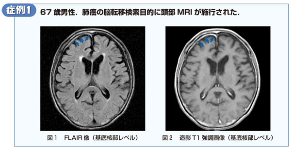

# くも膜肥厚（髄膜造影）

> MRIでいう「くも膜肥厚」は、実際にはくも膜単独の厚さではなく、軟膜・くも膜（leptomeninges）やくも膜下腔に沿う異常信号・造影を指していることが多い。脳溝や脳底槽に沿う線状・結節状造影では、髄膜病変を考える。

## 要点

- [[髄膜癌腫症]]では、造影T1強調像で脳溝・脳底槽・脳神経に沿う線状または結節状造影を認める。肺癌、乳癌、悪性黒色腫などに合併する。
- 髄膜炎でも髄膜造影を呈する。発熱、頭痛、項部硬直などがあれば感染性髄膜炎を考える。
- FLAIR像で脳溝・くも膜下腔が高信号になることがあり、髄液中の蛋白・細胞成分の増加などを反映する。
- 造影される硬膜（pachymeninges）と、脳表・脳溝に沿う軟膜／くも膜（leptomeninges）を区別する。
- 髄膜癌腫症が疑われる場合は、造影MRI（脳・必要に応じて脊髄）に加えて髄液細胞診などで評価する。

肺癌患者の脳転移検索MRI。脳溝に沿う異常を示す（個人学習用）。

## CBTチェック

- 「癌患者」＋「脳溝に沿う線状・結節状造影」→ [[髄膜癌腫症]]を考える。
- 「発熱・項部硬直」＋「髄膜造影」→ [[髄膜炎]]を考える。
- 「くも膜肥厚」≠慢性硬膜下血腫。慢性硬膜下血腫は硬膜下腔の三日月形血腫であり、くも膜自体の肥厚ではない。
