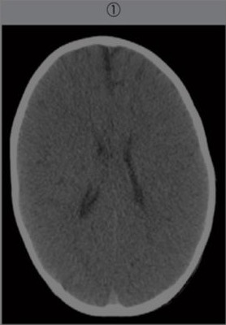
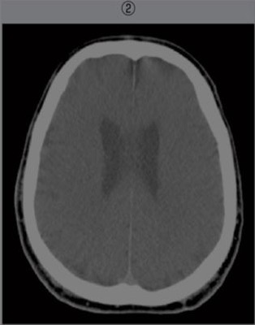
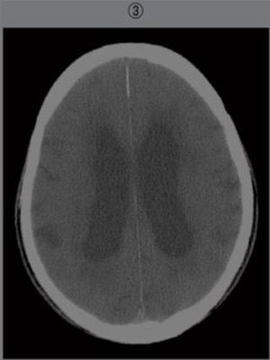

# 加齢による頭部CT変化

> 年齢とともに脳実質は緩徐に萎縮し、脳溝・脳裂と脳室が拡大する。頭蓋骨は乳幼児では薄く、成人では厚くなるため、頭部CTでは年齢による正常変化を考慮して読影する。

## 要点

- 乳幼児：頭蓋骨が薄く、脳溝・脳室は目立ちにくい。
- 成人：乳幼児より頭蓋骨が厚く、脳溝・脳室は中間的である。
- 高齢者：脳萎縮により脳溝・脳裂が開大し、側脳室も拡大する。
- 脳溝の開大と脳室拡大がセットでみられる場合は、まず加齢性脳萎縮を考える。
- 正常圧水頭症では脳室拡大に比べて高位円蓋部の脳溝が狭くなるなど、単純な脳萎縮とは異なる。

年齢の異なる頭部CT。①1歳、②50歳、③80歳（M3E 18210440、個人学習用）。

## CBTチェック

- 「脳溝・脳裂の開大」＋「側脳室拡大」→ 高齢者の脳萎縮を考える。
- 年齢の低い順は、頭蓋骨の厚さと脳萎縮の程度から「1歳→50歳→80歳」。
- 「認知症・歩行障害・尿失禁」＋「脳溝の開大が乏しい脳室拡大」→ 正常圧水頭症を考える。
