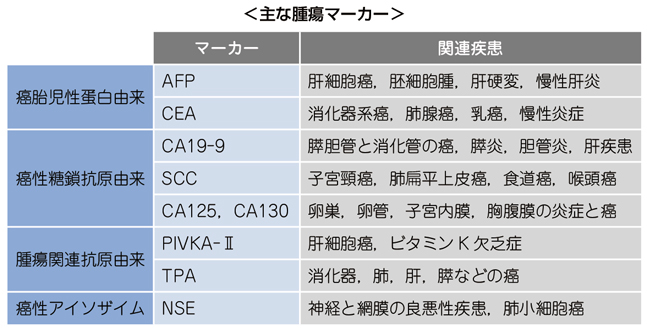

# 腫瘍マーカー

> **腫瘍マーカー**は、癌の診断を補助し、治療効果や再発を追う検査である。単独で癌の確定診断やスクリーニングには用いない。

## 要点

| マーカー     | 主に関連する癌                           | CBTでの要点                                                   |
| -------- | --------------------------------- | --------------------------------------------------------- |
| CA19-9   | [[膵癌]]、[[胆道癌]]、[[胃癌]]             | 膵癌・胆道癌で重要。胆汁うっ滞や[[膵炎]]でも上昇する。                             |
| CEA      | 大腸癌、胃癌、膵癌                         | 消化器癌の経過観察。喫煙でも上昇する。                                       |
| AFP      | [[肝細胞癌]]、卵黄嚢腫瘍                    | [慢性肝炎](../../03_疾患/消化器/慢性肝炎.md)・肝硬変でも上昇しうる。PIVKA-IIと組み合わせる。                          |
| PIVKA-II | [[肝細胞癌]]                          | ビタミンK依存性のγカルボキシル化が不十分な[[異常プロトロンビン]]。ビタミンK欠乏・ワルファリンでも上昇する。 |
| PSA      | [前立腺癌](../../03_疾患/腎・泌尿器/前立腺癌.md) | 前立腺癌で重要。前立腺炎・[前立腺肥大症](../../03_疾患/腎・泌尿器/前立腺肥大症.md)でも上昇する。                                |
| ProGRP   | 小細胞肺癌、神経内分泌腫瘍                  | ガストリン放出ペプチド前駆体。NSEとともに小細胞肺癌で上昇しやすいが、腎機能低下でも高値になりうる。 |

- CA125：[[卵巣癌]]。月経、子宮内膜症、腹膜炎でも上昇する。
- SCC：扁平上皮癌（子宮頸癌、食道癌、肺扁平上皮癌など）。
- NSE：小細胞肺癌、神経内分泌腫瘍。
- ProGRP（pro-gastrin-releasing peptide）：小細胞肺癌で用いられる腫瘍マーカー。腎機能低下では解釈に注意する。
- β-hCG：絨毛癌・精巣胚細胞腫瘍。妊娠でも上昇する。
- TPA：上皮性腫瘍で上昇するが特異性が低い。

[[PIVKA-II]]は *protein induced by vitamin K absence or antagonist-II* の略である。[[肝細胞癌]]ではAFPやAFP-L3分画と組み合わせて補助診断に用いるが、ビタミンK欠乏・ワルファリン投与時の高値は腫瘍を意味しない。

主な腫瘍マーカーの対応を示す図（M3E CBT 問題番号18301160、個人学習用）。

## CBTチェック

- 膵癌・胆道癌 → **CA19-9**。ただし良性胆道疾患でも上昇しうる。
- 肝細胞癌 → **AFP、PIVKA-II、AFP-L3分画**。PIVKA-IIだけが「ビタミンK欠乏でも上昇する」。
- 腫瘍マーカーの高値だけで癌とは診断せず、画像・病理所見と合わせて判断する。
