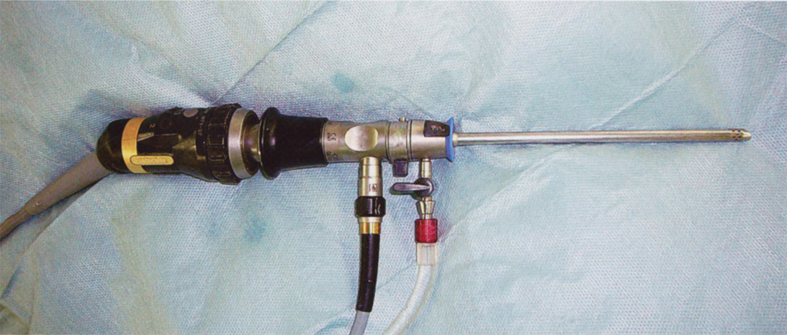

# 104回 A-9（改題）

## 問題

手術で用いられる器具を次に示す．
この器具を用いるのはどれか．**2つ選べ**．

図：関節内を観察・処置する関節鏡（出典：ユーザー提供画像、個人学習用）。

- a．滑膜炎
- b．腰椎分離症
- c．半月板障害
- d．脛骨疲労骨折
- e．アキレス腱断裂

## 正答・解説

**正答：a．滑膜炎、c．半月板障害**

- 写真の器具は関節鏡であり、関節内を直接観察し、必要に応じて滑膜切除や半月板の縫合・部分切除を行う。
- 腰椎分離症、脛骨疲労骨折、アキレス腱断裂は、通常この関節内視鏡の適応ではない。

関連：[[関節鏡]]

