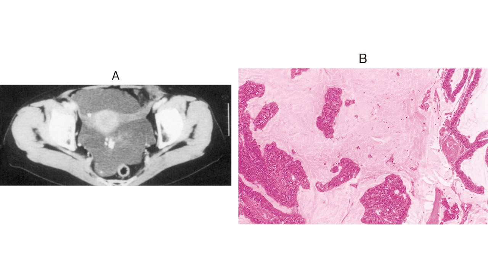

# 104回 D-30

## 問題

45歳の女性。腹囲が大きくなったことを主訴に来院した。半年前から徐々に腹囲が大きくなってきた。食欲はあり、体重に変化はみられない。排便の状況にも変化はない。月経周期26日型、整。身長156cm、体重46kg。体温36.2℃。脈拍72/分、整。血圧112/74mmHg。心音と呼吸音とに異常を認めない。腹部は全体に軽度膨隆している。肝・脾を触知しない。尿所見：蛋白（－）、糖（－）。血液所見：赤血球432万、Hb 12.1g/dL、Ht 38％、白血球6,200、血小板23万。血液生化学所見：血糖83mg/dL、総蛋白7.2g/dL、アルブミン4.0g/dL、総ビリルビン0.6mg/dL、AST 16IU/L、ALT 13IU/L、ALP 174IU/L（基準115～359）。免疫学所見：CRP 0.3mg/dL、CEA 26.4ng/mL（基準5以下）、CA19-9 60U/mL（基準37以下）。術前に施行した腹部造影CT（A）を次に示す。開腹手術を行うとゼリー状の物質と腫瘍が確認された。腫瘍のH-E染色標本（B）を次に示す。

Aは骨盤内に貯留する粘液性腹水、Bは豊富な粘液内に浮遊する腫瘍上皮を示す。

*出典：メディックメディア「からだクイズ」医104D30（個人学習用）*

原発臓器として考えられるのはどれか。2つ選べ。

- a. 胃
- b. 肝臓
- c. 虫垂
- d. 子宮
- e. 卵巣

## 正答・解説

**正答：c 虫垂、e 卵巣**

- 腹腔内のゼリー状粘液、緩徐な腹囲増大、粘液性腫瘍の病理像から[腹膜偽粘液腫](../../../03_疾患/消化器/腹膜偽粘液腫.md)を考える。
- 原発は多くが[[虫垂粘液性腫瘍]]で、卵巣の粘液性腫瘍も原発候補となるため、虫垂と卵巣を選ぶ。
- 現在は、女性で卵巣病変を伴っていても虫垂原発から卵巣への転移である例が多いと理解されている。
