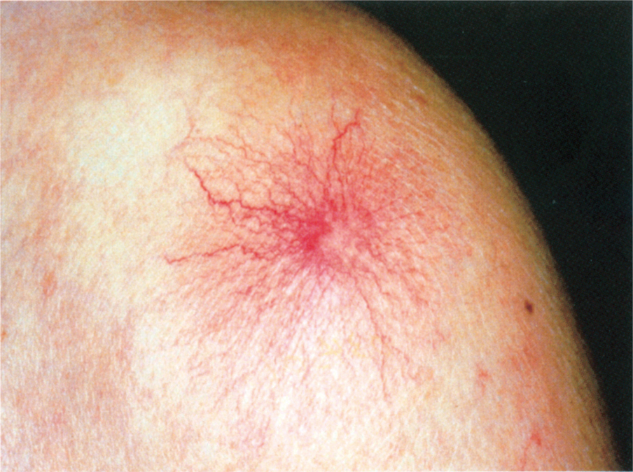

# 105回 B-42

## 問題

50歳の男性．皮疹を主訴に来院した．3ヵ月前から両肩と胸部とに赤い皮疹が多発しているのに気付いていた．25年の飲酒歴があり，肝機能障害を指摘されているが自覚症状はない．左肩の写真を次に示す．

中心の赤点から放射状に毛細血管が広がる、くも状血管腫。

出典：メディックメディア「からだクイズ」医105B42（個人学習用）

この皮膚症状に関連するのはどれか．

- ａ アンドロゲン
- ｂ エストロゲン
- ｃ コルチゾール
- ｄ アルドステロン
- ｅ プロゲステロン

## 正答・解説

**正答：ｂ エストロゲン**

- これは[[くも状血管腫]]であり、慢性肝障害でエストロゲンなどのステロイドホルモン代謝が低下して生じる。
- 血中エストロゲン増加と血管拡張が、くも状血管腫や手掌紅斑に関与する。
- 多量飲酒歴と肝機能障害から、[[アルコール関連肝疾患]]・[[肝硬変]]を考える。
