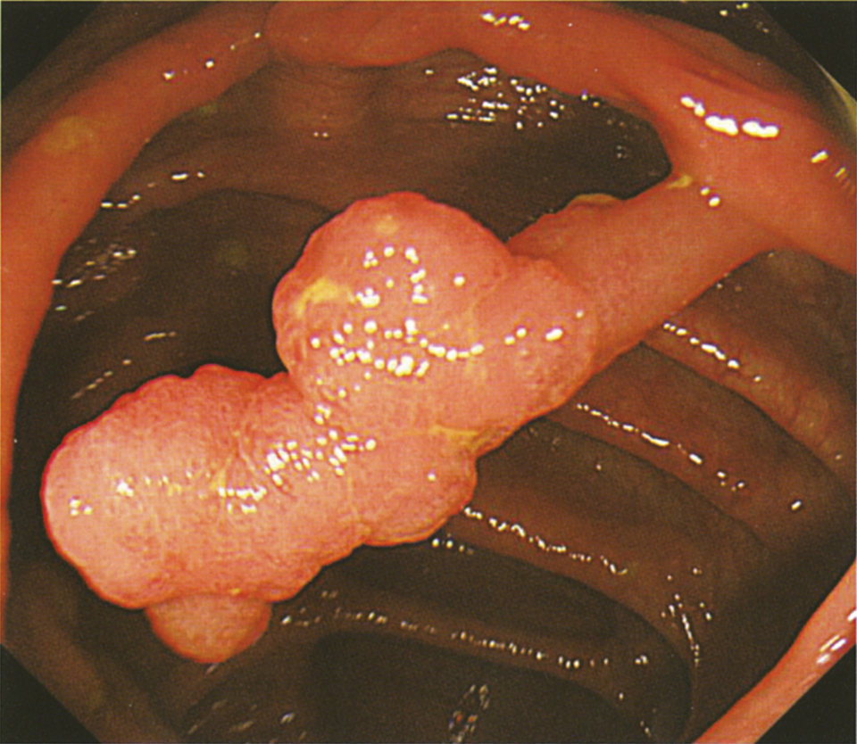

# 107回 B-59

## 問題

57歳の男性。便潜血検査で異常を指摘され精査のため来院した。

現病歴：50歳時に大腸ポリープで内視鏡的切除術を受けた。その後、特に症状を認めないためそのままにしていた。先日、同僚が大腸癌で手術を受けたため、自分も癌ではないかと気になり自宅近くの診療所を受診した。尿検査、血液検査および腹部超音波検査で異常はなく、便潜血検査で陽性を指摘され受診した。

既往歴：28歳時に急性虫垂炎で手術。

生活歴：喫煙は20本/日を25年間。飲酒はビール350mL/日を35年間。2年前から禁煙、禁酒している。

家族歴：父親が大腸癌のため89歳で死亡。

現症：身長165cm、体重67kg。体温36.6℃。脈拍72/分、整。血圧130/84mmHg。呼吸数14/分。右下腹部に軽度の圧痛と手術後の瘢痕とを認める。筋性防御と反跳痛とを認めない。腫瘤を触知しない。

検査所見：血液検査：赤血球420万、Hb 13.4g/dL、Ht 42％、白血球8,200、血小板28万。血液生化学所見：総蛋白7.2g/dL、アルブミン3.8g/dL、総コレステロール230mg/dL、AST 36IU/L、ALT 36IU/L。CRP 0.03mg/dL。これまでの臨床経過と既往歴から下部消化管内視鏡検査を行った。下行結腸の内視鏡像を次に示す。

下行結腸の有茎性ポリープを示す内視鏡像。

*出典：メディックメディア「からだクイズ」医107B58〜60連問共有画像（個人学習用）*

適切な治療はどれか。

- a. 開腹大腸切除術
- b. クリッピング
- c. 内視鏡的切除術
- d. 腹腔鏡下大腸切除術
- e. メサラジン（5-ASA製剤）の投与

## 正答・解説

**正答：c 内視鏡的切除術**

- 内視鏡像は有茎性の[[大腸腺腫]]を示す。大腸腺腫は[[大腸癌]]の前駆病変になりうる。
- 良性が疑われる有茎性ポリープは、内視鏡的ポリペクトミーで切除する。
- 外科的切除は、内視鏡切除が困難な病変や浸潤癌が疑われる場合に検討する。
