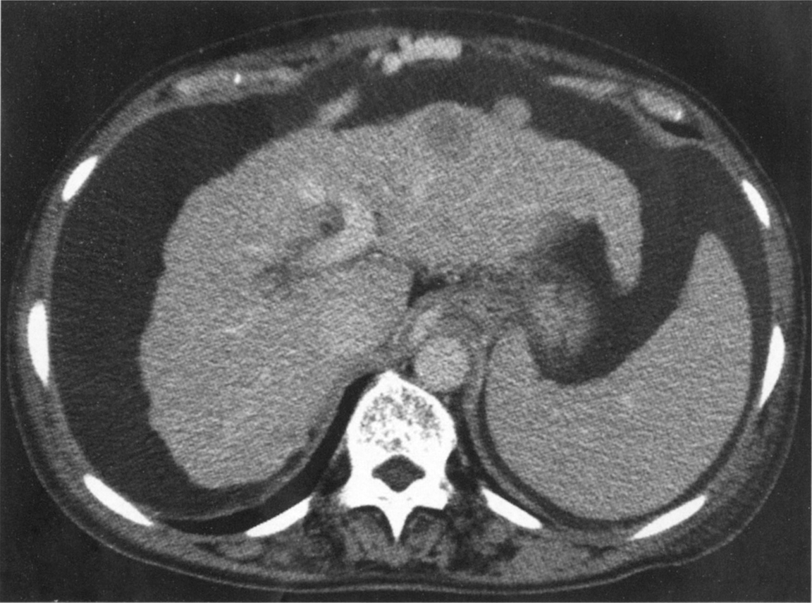

# 108回 D-18

## 問題

腹部造影CTを次に示す．この患者の血液検査項目で低値と予想されるのはどれか．2つ選べ．

肝表面の結節化と脾腫は、[[肝硬変]]に伴う[[門脈圧亢進]]を示唆する。

出典：メディックメディア「からだクイズ」医108D18（個人学習用）。

- a．アルブミン
- b．アンモニア
- c．γ-グロブリン
- d．血小板
- e．総ビリルビン

## 正答・解説

**正答：a．アルブミン、d．血小板**

- [[肝硬変]]では肝の蛋白合成能が低下するため、アルブミンは低下する。
- [[門脈圧亢進]]による脾腫・脾機能亢進により、血小板は低下する。
- アンモニアは肝での代謝低下により上昇し、γ-グロブリンは高値となりうる。
- 総ビリルビンは肝機能低下で上昇しうる。
