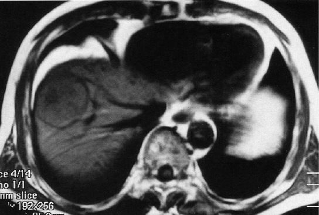

# 91回 A-49

## 問題

健康診断の腹部超音波検査で肝に腫瘤を指摘された。腹部単純MRI、T1強調画像を次に示す。腫瘤の存在部位はどれか。

*肝右葉前区域の腫瘤を示すT1強調MRI。出典：メディックメディア「からだクイズ」医91A49（個人学習用）*

- a. 尾状葉
- b. 左外側区域
- c. 内側区域
- d. 前区域
- e. 後区域

## 正答・解説

**正答：d 前区域**

- 腫瘤は肝右葉の前区域にあり、前区域は[[肝区域と脈管]]のS5・S8に相当する。
- 右葉では、右肝静脈を境に前区域（腹側）と後区域（背側）を区別する。
