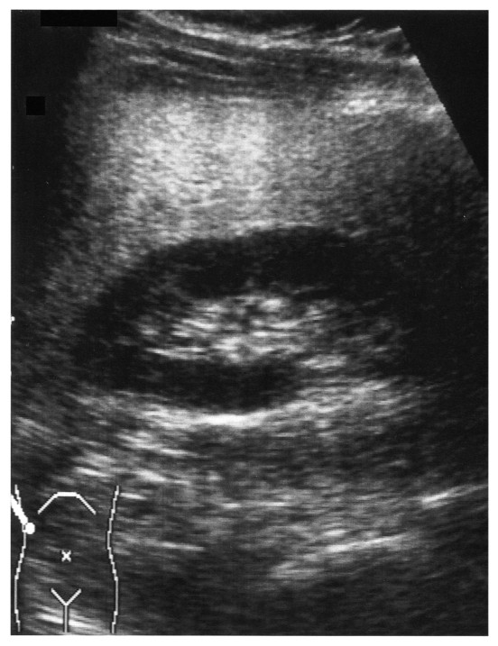

# 92回 E-7

## 問題

48歳の男性．健康診査で肝機能異常を指摘されて来院した．血清生化学所見：総蛋白7.0g/dL，アルブミン4.0g/dL，総ビリルビン0.5mg/dL，AST 42単位，ALT 60単位，トリグリセリド310mg/dL．HBs抗原陰性，HCV抗体陰性．腹部超音波断層写真を次に示す．この肝機能障害の原因となりうるのはどれか．3つ選べ．

肝実質が腎皮質より高エコーとなる肝腎コントラストの増強は、[[脂肪肝]]を示唆する。

出典：メディックメディア「からだクイズ」医92E7（個人学習用）。

- a．アルコール摂取
- b．抗生物質服用
- c．膠原病
- d．糖尿病
- e．肥満

## 正答・解説

**正答：a．アルコール摂取、d．[[糖尿病]]、e．肥満**

- 高トリグリセリド血症と超音波の肝腎コントラスト増強から、脂肪肝を考える。
- 肥満・糖尿病などの代謝異常は[[MASLD]]の背景となる。アルコール摂取も脂肪肝の原因である。
- 抗生物質は[[薬剤性肝障害]]を起こしうるが、この典型像の脂肪肝の主な原因としては選ばない。
- [[膠原病]]はこの所見からまず考える病因ではない。
