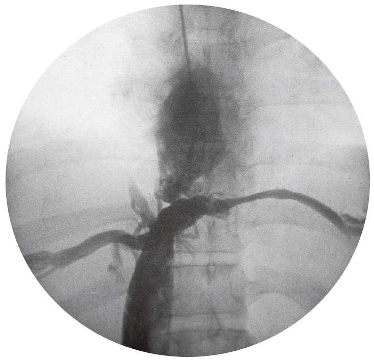

# 96回 A-23

## 問題

24歳の男性．下肢の浮腫を主訴に来院した．眼球結膜に軽度の黄染を認める．頸部の静脈怒張はない．軽度の腹水貯留と下腿の中等度の浮腫・静脈怒張とを認める．血清生化学所見：尿素窒素15mg/dL，クレアチニン0.8mg/dL，総ビリルビン3.1mg/dL，直接ビリルビン0.7mg/dL，AST 40単位，ALT 52単位，ALP 483単位（基準260以下）．下大静脈造影と右房造影とを同時に施行した写真を次に示す．

下大静脈から右房への造影剤流入が遮断され、側副血行路が描出されている。

出典：メディックメディア「からだクイズ」医96A23（個人学習用）

最も考えられるのはどれか．

- ａ 腎不全
- ｂ 肝癌
- ｃ 上大静脈症候群
- ｄ Budd-Chiari症候群
- ｅ 胆石

## 正答・解説

**正答：ｄ Budd-Chiari症候群**

- [[Budd-Chiari症候群]]では、[[肝静脈]]から肝部[[下大静脈]]にかけての静脈流出が障害され、腹水・黄疸・下肢浮腫をきたす。
- 造影で下大静脈から右房への流入障害と側副血行路が確認できる。
- 腎機能は保たれ、頸静脈怒張もないため、腎不全や[[上大静脈症候群]]は考えにくい。
