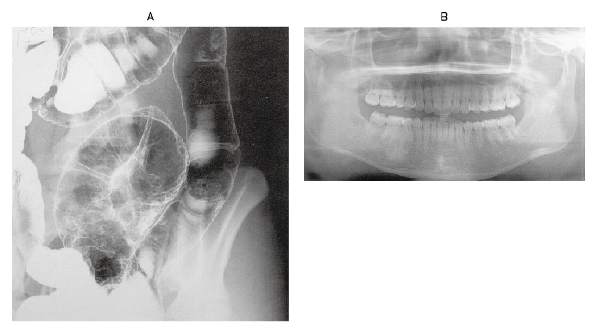

# 98回 D-26

## 問題

35歳の男性。血便を主訴に来院した。数年前から下顎の違和感と腫脹とを認めていた。同じ頃から血便を繰り返していたが、数日前から血便の程度が強くなった。血液所見：赤血球320万、Hb 11.5g/dL、血小板17万。注腸造影写真（A）とパノラマ撮影による顎骨のX線写真（B）とを次に示す。

Aは大腸の多発ポリープ、Bは下顎骨の骨腫を示す。

*出典：メディックメディア「からだクイズ」医98D26（個人学習用）*

今後出現が予測されるのはどれか。2つ選べ。

- a. 中枢神経症状
- b. 口唇色素沈着
- c. 難治性下痢
- d. 大腸癌
- e. 軟部腫瘍

## 正答・解説

**正答：d [[大腸癌]]、e 軟部腫瘍**

- 注腸造影の多発大腸ポリープと下顎骨の骨腫から、[[Gardner症候群]]（腸管外病変を伴う[[家族性大腸腺腫症]]）と診断する。
- FAPでは大腸癌のリスクが非常に高い。
- 軟部腫瘍として、腹腔内・腹壁の[[デスモイド腫瘍]]を生じうる。
